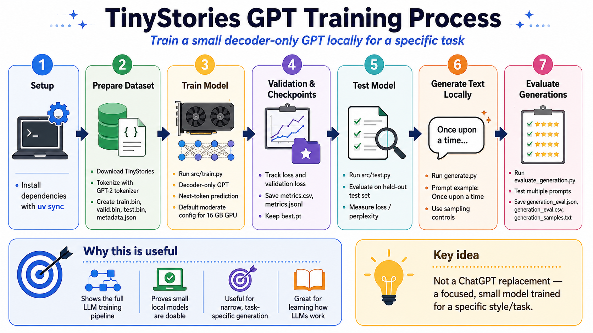
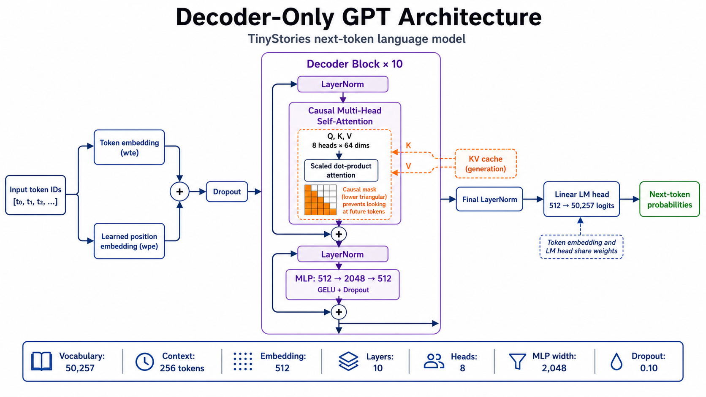

# TinyStories GPT from Scratch

A small decoder-only GPT training project for learning the full local LLM workflow: prepare TinyStories data, train a GPT-style model, evaluate checkpoints, generate text, and stream generations from a local API.

## Process Flow

The project follows one end-to-end path from raw TinyStories data to evaluated
text generation:

`setup → prepare dataset → train → validate and checkpoint → test → generate → evaluate generations`



## Model Architecture

The model is a decoder-only Transformer for next-token prediction. Token and
learned position embeddings pass through 10 pre-norm decoder blocks, followed
by a final LayerNorm and a weight-tied language-model head. Each decoder block
contains causal multi-head self-attention and a GELU MLP with residual
connections. During generation, the attention layers can reuse a KV cache.



## What This Builds

This repo trains a compact GPT model from scratch with TinyStories and GPT-2 `tiktoken` tokenization. It is plain next-token pretraining, not instruction tuning or a ChatGPT replacement. The goal is a focused local model that can learn short-story structure and task-specific generation behavior.

## Files

- `src/config.py` - model, dataset, train, and generation configuration
- `src/prepare_dataset.py` - downloads TinyStories, tokenizes with GPT-2 tokenizer, and creates train/valid/test `.bin` files
- `src/create_model.py` - builds the GPT model, including KV-cache generation and sampling controls
- `src/train.py` - trains, validates, saves checkpoints, and records metrics
- `src/test.py` - evaluates test loss/perplexity and saves generated samples
- `main.py` - runs prepare/train/test end to end
- `generate.py` - generates text from a PyTorch checkpoint
- `evaluate_generation.py` - evaluates prompts and saves generation metrics/samples
- `server.py` - serves cached generation as a FastAPI Server-Sent Events endpoint
- `assets/process_flow.png` - workflow diagram used in this README
- `assets/decoder_only_gpt_architecture.png` - model architecture diagram used in this README

## Setup

```bash
uv sync
```

If using plain Python instead of `uv`:

```bash
python3 -m venv .venv
source .venv/bin/activate
pip install -r requirements.txt
```

## Run End To End

```bash
uv run python main.py \
  --description "baseline 50k stories"
```

Useful options:

```bash
uv run python main.py --max-stories 100000
uv run python main.py --all-stories
uv run python main.py --skip-prepare --dataset-dir data/processed/max_stories_50000
uv run python main.py --skip-train --checkpoint runs/tinystories-gpt/<experiment-folder>/best.pt
uv run python main.py --device cpu
uv run python main.py --keep-checkpoints
```

## Run Step By Step

```bash
uv run python src/prepare_dataset.py --max-stories 50000

uv run python src/train.py \
  --dataset-dir data/processed/max_stories_50000 \
  --description "baseline 50k stories"

uv run python src/test.py \
  --dataset-dir data/processed/max_stories_50000 \
  --checkpoint runs/tinystories-gpt/<experiment-folder>/best.pt
```

Prepared datasets are written under a max-stories-labeled folder:

```text
data/processed/max_stories_50000/train.bin
data/processed/max_stories_50000/valid.bin
data/processed/max_stories_50000/test.bin
data/processed/max_stories_50000/metadata.json
```

Training creates timestamped experiment folders:

```text
runs/tinystories-gpt/yyyy_mm_dd_hh_mm/
```

Each experiment folder includes `config.json`, `experiment.json`, metrics files, and `best.pt`. After a successful run, intermediate `ckpt_*.pt` files and `last.pt` are deleted by default. Use `--keep-checkpoints` to retain them.

## PyTorch Generation

Generate from the latest available `best.pt` checkpoint:

```bash
uv run python generate.py \
  --prompt "Once upon a time"
```

Generate from a specific checkpoint:

```bash
uv run python generate.py \
  --checkpoint runs/tinystories-gpt/<experiment-folder>/best.pt \
  --prompt "Once upon a time"
```

Generation uses the KV cache by default. To compare against the slower full-context path:

```bash
uv run python generate.py \
  --checkpoint runs/tinystories-gpt/<experiment-folder>/best.pt \
  --prompt "Once upon a time" \
  --no-kv-cache
```

Current default sampling controls:

```text
temperature: 0.7
top_k: 50
repetition_penalty: 1.05
no_repeat_ngram_size: 4
generate.py max_new_tokens: 200
evaluation/API max_new_tokens: 300
```

For deterministic greedy generation:

```bash
uv run python generate.py \
  --checkpoint runs/tinystories-gpt/<experiment-folder>/best.pt \
  --prompt "Once upon a time" \
  --temperature 0 \
  --top-k 0 \
  --repetition-penalty 1 \
  --no-repeat-ngram-size 0
```

## Generation Evaluation

Evaluate the prompts in `eval_prompts.txt`:

```bash
uv run python evaluate_generation.py \
  --checkpoint runs/tinystories-gpt/<experiment-folder>/best.pt
```

This writes:

```text
runs/tinystories-gpt/<experiment-folder>/generation_eval/generation_eval.json
runs/tinystories-gpt/<experiment-folder>/generation_eval/generation_eval.csv
runs/tinystories-gpt/<experiment-folder>/generation_eval/generation_samples.txt
```

Use `--num-samples-per-prompt`, `--seed`, and the same sampling flags as `generate.py` when comparing generation quality across runs.

## Streaming API

`server.py` loads the latest available checkpoint using the same resolution path as `generate.py`, then exposes cached token streaming at `POST /generate/stream`. Start it after at least one `best.pt` checkpoint exists.

```bash
uv run uvicorn server:app --reload
```

Example request:

```bash
curl -N http://127.0.0.1:8000/generate/stream \
  -H "Content-Type: application/json" \
  -d '{
    "prompt": "Once upon a time",
    "max_new_tokens": 100,
    "temperature": 0.7,
    "top_k": 50
  }'
```

The response is `text/event-stream` with `start`, `token`, `done`, and `error` events.

## First-Run Advice

Start with `max_stories = 50_000` in `src/config.py` or pass `--max-stories 50000`. Once the pipeline works, increase it to `100_000`, `500_000`, or use `--all-stories`.

For a 16 GB GPU, the default config is intentionally moderate:

```text
layers: 10
heads: 8
embedding: 512
context: 256
batch_size: 16
gradient_accumulation_steps: 4
```

Effective tokens per optimization step:

```text
batch_size x gradient_accumulation_steps x block_size
= 16 x 4 x 256
= 16,384 tokens
```

## Outputs

After training:

```text
runs/tinystories-gpt/yyyy_mm_dd_hh_mm/config.json
runs/tinystories-gpt/yyyy_mm_dd_hh_mm/experiment.json
runs/tinystories-gpt/yyyy_mm_dd_hh_mm/metrics.csv
runs/tinystories-gpt/yyyy_mm_dd_hh_mm/metrics.jsonl
runs/tinystories-gpt/yyyy_mm_dd_hh_mm/best.pt
runs/tinystories-gpt/yyyy_mm_dd_hh_mm/test_results.json
```

`data/` and `runs/` are ignored by git, so prepared datasets, checkpoints, metrics, and local evaluation artifacts stay on this machine unless you copy them elsewhere.
